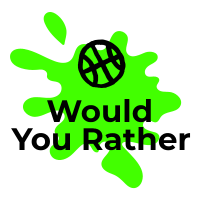

<h1 align="center">
  
</h1>
<h3 align="center">
  Play <b>Would You Rather</b>. Answer and create questions
</h3>

<p align="center">
  <a href="#rocket-about-the-project">About the project</a>&nbsp;&nbsp;&nbsp;|&nbsp;&nbsp;&nbsp;
  <a href="#ballot_box_with_check-goals">Goals</a>&nbsp;&nbsp;&nbsp;|&nbsp;&nbsp;&nbsp;
  <a href="#checkered_flag-installation">Installation</a>
</p>

## :rocket: About the project
A simple app to create and answer "would you rather" questions. This project corresponds to the second project of the Udacity's [React Nanodegree](https://www.udacity.com/course/react-nanodegree--nd019).

## :ballot_box_with_check: Goals
Practice knowledge of React and Redux acquired in Udacity's [React nanodegree](https://www.udacity.com/course/react-nanodegree--nd019). Understand how to create a real world app with React and Redux.

## :checkered_flag: Installation
First of all, make sure that you have Node.js installed on your machine. Using npm.

Now, to install the dependencies

```
    npm install
```

To start the application
```
    npm start
```